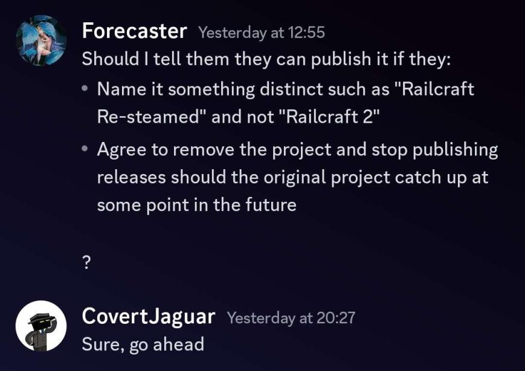

# Railcraft Reborn Mod License

## Usage

* The "*.toml" files in the config folder are not considered part of Railcraft Reborn and may be
  freely distributed.

* The Railcraft Reborn API is not considered part of Railcraft Reborn and may be freely distributed
  and/or used as you see fit, according to the MIT License.

* You may not use Railcraft Reborn to generate revenue for yourself except in the cases listed
  below.

    * You may not distribute modified versions of Railcraft Reborn.

    * You may install Railcraft Reborn on multiplayer servers and are **ALLOWED** to earn revenue as
      you desire from server usage fees, donations, sold services, or anything else you can come up
      with.
        * If you wish to create a **public** client bundle including Railcraft Reborn for your
          users, you must follow the Public Mod Pack Restrictions below.
        * **Private client bundles are permitted without requiring that you meet the restrictions on
          Public Mod Packs, but they must be protected via password or white-list in such a way that
          only server users are allowed to access it.**

## Derivatives

* You may create, publish, and earn revenue from a texture pack made for Railcraft Reborn so long as
  it contains no Railcraft Reborn code. Additionally, you may use, modify, and distribute any png
  files or their contents from Railcraft Reborn in your Railcraft Reborn Texture Pack as long as you
  provide attribution and a link to the
  [Railcraft Reborn GitHub](https://github.com/railcraft-reborn/railcraft).

* You can create, publish, and earn revenue from an add-on built for Railcraft Reborn using the
  Railcraft Reborn API (add-on is defined as a mini-mod that requires Railcraft Reborn to be 
  installed to work), though Sm0keySa1m0n and 3divad99 reserve the right to implement similar 
  functionality if desired. However, no addon code will ever be included in Railcraft Reborn 
  without the permission of the addon makers.

* You may create, publish, and earn revenue from videos that display all or part of Railcraft
  Reborn.

* You may create, publish, and earn revenue from maps that require Railcraft Reborn. You may
  distribute Railcraft Reborn with your map if you meet the Public Mod Pack requirements defined
  below. If you require your users to install Railcraft Reborn, provide a link to
  the [Railcraft Reborn GitHub](https://github.com/railcraft-reborn/railcraft).

## Distribution

* Except in the case of public Mod Packs, Railcraft Reborn may not be publicly distributed on 
  another site without the express permission of the authors. And if you have permission you 
  must include a link to the
  [Railcraft Reborn GitHub](https://github.com/railcraft-reborn/railcraft).

## Public Mod Packs

* This section pertains **ONLY** to publicly available mod packs. The section does not apply to
  Private Server Packs as defined previously in the Usage Section.
     * You may not sell the mod pack.
     * You must provide a link to the
       [Railcraft Reborn GitHub](https://github.com/railcraft-reborn/railcraft)
     * Nightlies builds are never to be packaged as part of a public mod pack.

## Source

* You may not create works using the Railcraft Reborn code (source or binary) without
  explicit permission except in the cases listed in this license.

* The source code is hosted on [GitHub](https://github.com/railcraft-reborn/railcraft)

* You may **NOT** create derivative Jars from Railcraft Reborn source to distribute to other users.

* You **MAY** use snippets of Railcraft Reborn Code posted on the Official GitHub in your own
  projects, but only if your project consists of less than 25% of Railcraft Reborn derived code. You
  must give credit to the Railcraft Reborn Project for the code used, including a link to the GitHub
  Project. Put this in your class file headers that contain Railcraft Reborn code, in your readme,
  and on the main download page.

* You may **NOT** use Railcraft Reborn Art Assets in other projects **unless** the project is
  intended to operate alongside Railcraft Reborn. Examples are Addons and InterMod Integration.

* You **MAY** fork and edit the GitHub Project for the purpose of contributing to the Official
  Railcraft Reborn Project. You may **NOT** distribute any Jar created from a fork for any reason.

## Licensed by CovertJaguar
Many of you will remember this mod from versions prior to 1.12.2.  
For those who suspect that we are infringing on some Railcraft-related licence, we would like 
to remind you that we have asked CovertJaguar for permission to publish this mod as Railcraft 
Reborn.

